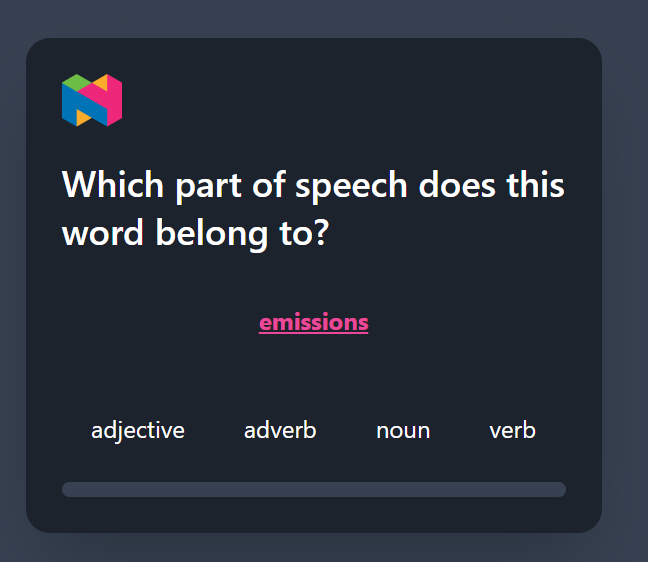
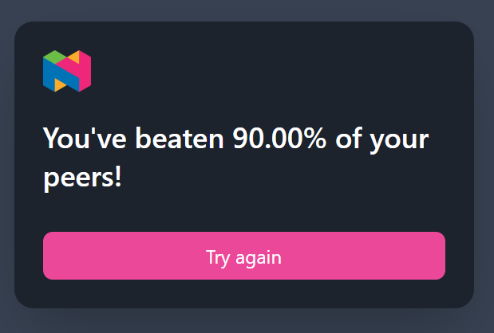

# javascript-task

## How to run the server
1. `cd ./server`
2. `npm start`

The server consists of **2 endpoints**:

`GET /words` => returns a list of 10 random words with at least 1 word from each pos present in the wordsList

`POST /rank` => takes an exam score and returns its corresponding rank compared to other students scores (rounded to the nearest hundredth) 

---
## How to run the client
1. `cd ./client`
2. `npm start`

In the Homepage:
- The student can start solving some questions regarding Parts of Speech
- A word will be shown one at a time with 4 choices that he can choose from.
- He can track his progress through the progress bar at he bottom
- On selcting the correct answer, the progress bar will turn green, on wrong answers it will turn red

In the Ranking screen:
- After finishing the test, the student can see how he ranks against his peers and he has the option to take the exam again

---
## Screenshots

